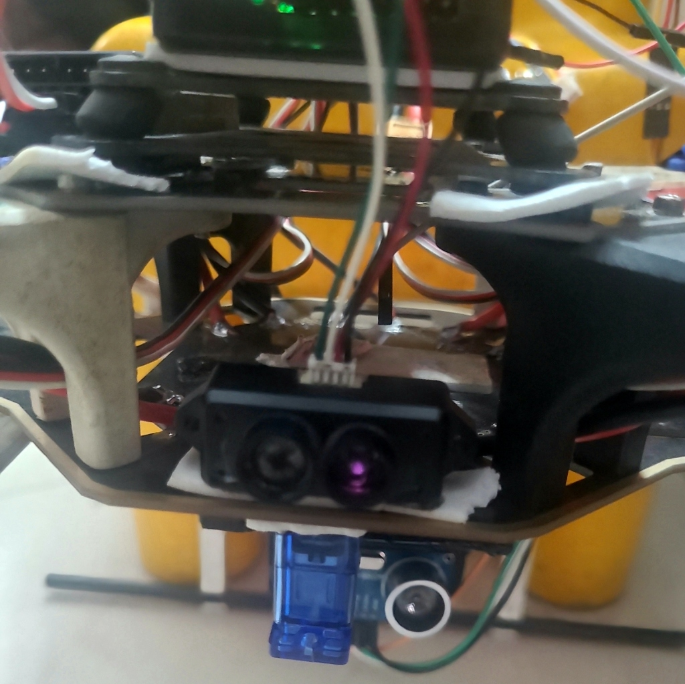
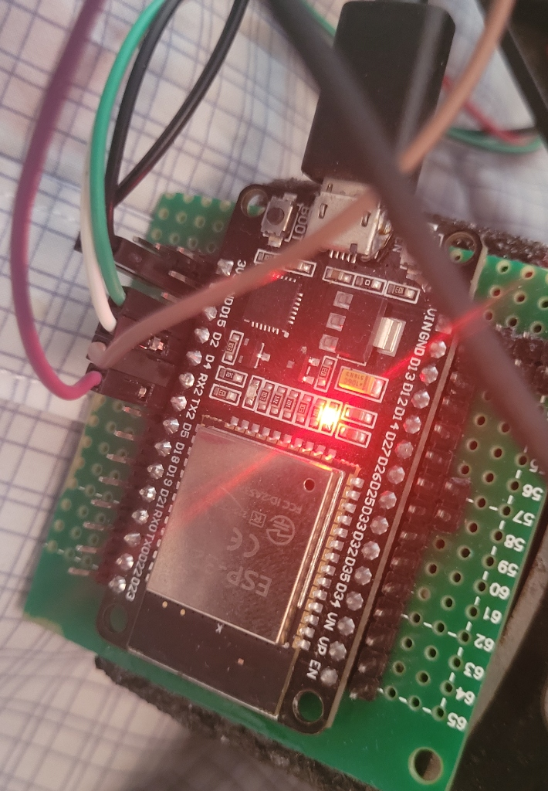
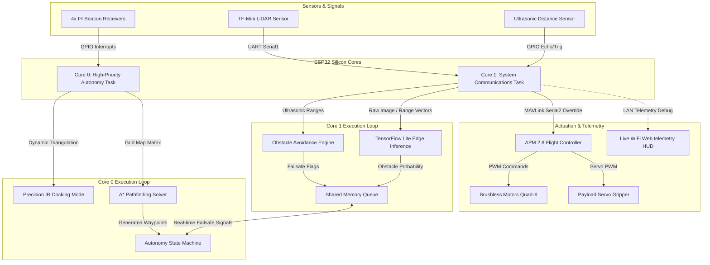

# 📦 Autonomous Warehouse Drone v2
**GPS-Denied Indoor UAV Package Delivery Platform Mapped via Dual-Core FreeRTOS A* Autonomy, IR Beacon Triangulation, & TensorFlow Lite Edge Inference**

[](https://github.com/yogesh031020/warehouse-drone-v2)
[](https://www.espressif.com/)
[](https://ardupilot.org/)
[](https://github.com/yogesh031020/warehouse-drone-v2)

---

## 🚀 Project Overview
**Warehouse Drone v2** is a fully autonomous, GPS-denied indoor quadcopter designed for automated logistics and package delivery inside industrial warehouse grids. 

Bypassing the need for external GPS or costly motion-capture networks, the UAV is controlled by a custom **ESP32 companion computer** running a low-latency, dual-core **FreeRTOS** operating kernel. The companion computer dynamically solves real-time 3D flight maps using an **A* pathfinding engine**, performs high-accuracy **IR beacon triangulation** for ±3cm docking, and handles forward collision mapping using a **TensorFlow Lite Micro** edge machine learning model.

---

## 📸 Avionics Showcase
<div align="center">
  <table border="0">
    <tr>
      <td></td>
      <td></td>
    </tr>
  </table>
  <p><i>Left: Dual-Beam Ultrasonic Rangefinder & Servo Package Gripper | Right: ESP32 Avionics Core Interface</i></p>
</div>

---

## 🧠 System Architecture & Multi-Tasking Loop
To achieve rapid <50ms obstacle avoidance reaction times and low-latency navigation, the ESP32’s dual cores partition computational tasks using a strict **FreeRTOS task schedule**:



---

## 🛠️ Systems Engineering: Key Technical Challenges

> [!WARNING]  
> **Computational Latency on Single-Core Loops**  
> **Challenge:** Running A* pathfinding, MAVLink serial loops, and sensor processing in a single execution loop caused cycles to jump to ~180ms. This made flight control extremely laggy, resulting in crashes.  
> **Solution:** Migrated the architecture to a **dual-core FreeRTOS concurrency model**. Мapped the A* pathfinding and state-machine strictly to **Core 0**, while offloading telemetry, LiDAR UART, and Ultrasonic loops to **Core 1**. This cut computational latency to a clean **~40ms**.

> [!IMPORTANT]  
> **IR Triangulation Ambient Interference**  
> **Challenge:** Ambient light and reflection off warehouse metal columns introduced a 15cm position variance in IR beacon signals, causing docking misses.  
> **Solution:** Engineered a hardware-software bandpass signal filter and implemented a 4-beacon redundancy voting array. Triangulation calculations are executed using interrupt triggers, reducing alignment errors to **±3cm**.

> [!TIP]  
> **TFLite Obstacle Pattern Inference**  
> **Challenge:** Classic ultrasonic distance checks struggle to classify moving humans vs. static boxes.  
> **Solution:** Integrated an onboard **TensorFlow Lite Micro** inference model running an optimized neural network. Mapped distance vectors to identify human motion footprints at a **<50ms reaction threshold**.

---

## 🔌 Hardware Configuration & Mappings

| Component | Hardware Module | Purpose / Role | Interface / Mapped Pins |
| :--- | :--- | :--- | :--- |
| **Companion Computer** | ESP32-WROOM-32 | Multi-tasking Navigation & A* Planner | Core CPU |
| **Flight Controller** | APM 2.8 | Flight Dynamics & Attitude Control | Serial2 (TX: GPIO 17, RX: GPIO 16) |
| **Altitude Sensor** | TF-Mini LiDAR | Downward altitude lock | UART Serial1 (TX: GPIO 9, RX: GPIO 10) |
| **Collision Sensor** | HC-SR04 Ultrasonic | Forward obstacle avoidance | Trig: GPIO 14, Echo: GPIO 27 |
| **Docking Suite** | 4x TSOP38238 IR Rx | Grid quadrant triangulation | GPIO 32, 33, 34, 35 (Hardware interrupts) |
| **Payload Actuator** | MG90S Metal Servo | Package release mechanism | GPIO 25 (High-Frequency PWM) |
| **Visual Debug** | Onboard LED | Telemetry heartbeat indicator | GPIO 2 (Digital Out) |

---

---

## 🛠️ Step-by-Step "How to Run" & Deployment Guide

To deploy the dual-core FreeRTOS autonomous companion computer on your physical warehouse UAV, follow these steps:

### 1. Configure the Arduino Development IDE
1. Open the [Arduino IDE](https://www.arduino.cc/en/software).
2. Install the **ESP32 Core** (Espressif v2.0.0+) by adding `https://dl.espressif.com/dl/package_esp32_index.json` to your Preferences.
3. Install the required **TensorFlow Lite Micro** library:
   * Go to **Sketch ➔ Include Library ➔ Manage Libraries...**
   * Search for `TensorFlowLite_ESP32` or download the Flatbuffer-compatible ESP32 compilation zip, and import it.

### 2. Configure Coordinates & Flatbuffer Weights
1. Open `warehouse_drone.ino` in your IDE. This automatically imports all tabs.
2. Edit `config.h` to set your target destination coordinate grid coordinates:
   ```cpp
   #define TARGET_GRID_X  4   // Destination grid x
   #define TARGET_GRID_Y  6   // Destination grid y
   #define TARGET_GRID_Z  2   // Safe flight altitude (m)
   ```
3. *(Optional)* If you retrained the obstacle classifier network, open `model_data.h` and update the `g_model` array with your compiled flatbuffer binary weights.

### 3. Flash the Companion Core
1. Connect the ESP32 to your PC using a micro-USB data cable.
2. Under **Tools**, select Board: **ESP32 Dev Module** and the correct COM Port.
3. Verify that your partition scheme supports at least **1.2MB APP + OTA** (Huge APP scheme) to accommodate the TensorFlow Lite model.
4. Click **Upload** to compile and transfer the firmware to the ESP32 flash chip.

### 4. Physical Setup & Calibration
1. Mount the 4x **TSOP38238 IR sensors** on the outer corners of your drone frame (pointing outwards and slightly down).
2. Place your **38kHz active IR beacons** in the four corners of your designated flight testing room.
3. Ensure the **MG90S package gripper servo** is powered by a dedicated **5V BEC** power rail to prevent transient inductive voltage spikes from crashing the ESP32.
4. Verify the dual-beam HC-SR04 sonar sensors are calibrated and pointed forward.

### 5. Launch Autonomous Mission
1. Power on the beacons and then power the UAV avionics stack.
2. Enable manual flight overrides on your RC transmitter as a physical safety interlock.
3. Arm the APM flight controller in **ALT_HOLD** mode.
4. Once altitude hold is stable, engage the companion override switch.
5. The ESP32 Core 0 A* solver will calculate the grid waypoints, initiate the dynamic IR triangulation tracking loop, navigate the grid avoiding obstacles with Core 1 sonars, trigger the MG90S servo to release the payload at the destination grid, and autonomously trigger the land sequence!

---

## 📂 Repository Directory Layout

```directory
warehouse-drone-v2/
├── config.h               # Grid layout, coordinate matrices, and pin configurations
├── gripper.h              # Servo release driver library
├── ir_beacon.h            # IR interrupt parsing and triangulation equations
├── lidar.h                # Downward LiDAR TF-Mini distance estimator
├── mavlink_comm.h         # Advanced MAVLink telemetry protocol interface
├── ml_inference.h         # TensorFlow Lite Micro classifier interface
├── model_data.h           # Compiled flatbuffer neural network weights
├── obstacle_avoid.h       # Ultrasonic array driver and alert threshold loop
├── path_planner.h         # Optimized C++ A* 3D pathfinding engine
├── state_machine.h        # Mission state loops (Takeoff, Path, Dock, Release, Land)
├── ultrasonic.h           # High-precision HC-SR04 sonar pulse handler
├── warehouse_map.h        # 3D grid voxel matrix representation
├── wifi_debug.h           # UDP-based LAN telemetry logging engine
├── warehouse_drone.ino    # Core Arduino entry sketch orchestrating FreeRTOS tasks
├── docs/
│   ├── Hardware_Wiring_Map.md # Detailed system wiring and logic schematic
│   ├── warehouse_v2_execution.log # Real-time mission execution and ML debug log
│   └── images/
│       ├── drone_front.jpg    # Front flight assembly visual showcase
│       └── drone_esp32.jpg    # Close-up companion board hardware layout
└── LICENSE                # MIT License
```

---

### **Aeronautical & Autonomy Systems Engineering Portfolio**
*   **Developed by:** Yogesh E S - Aeronautical Systems Engineer
*   **Contact/Portfolio:** [GitHub Profile](https://github.com/yogesh031020)
