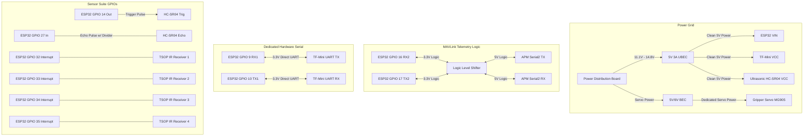

# 🔌 Warehouse Drone v2: Systems Wiring Map
**Detailed Avionics Pinouts, Logic Level Shifting, & Power Grid Distribution**

This document establishes the electrical interfaces and pin mapping between the **ESP32 companion computer**, the **APM 2.8 flight controller**, and the comprehensive sensor/actuator suite.

---

## 📊 Schematic Topology

---

## ⚡ Core Wiring Map

### 1. Power Distribution Rail
The ESP32 processes high-frequency A* algorithms and TensorFlow Lite inference while the servo gripper actuates. This can pull significant current transients. Mismatching power lines will trigger brown-outs or reset your flight controllers.

| Source | Voltage | Destination Pin | Purpose |
| :--- | :--- | :--- | :--- |
| **5V 3A UBEC** | `5V (VCC)` | ESP32 `VIN` / `5V` | Primary companion logic power |
| **5V 3A UBEC** | `5V (VCC)` | TF-Mini `VCC` | Primary downward LiDAR power |
| **5V 3A UBEC** | `5V (VCC)` | HC-SR04 `VCC` | Forward Ultrasonic array power |
| **Dedicated Servo BEC** | `5V-6V` | MG90S Servo `VCC` | Actuator motor power (isolated from sensor rail) |
| **PDB Ground** | `GND` | Common Ground Bus | Connect all GND pins together to prevent floating signals |

---

### 2. Signal & Mapped Pinouts

| Device 1 (From) | Pin Mapped | Protocol / Bus | Device 2 (To) | Pin Mapped | Electrical Level / Details |
| :--- | :--- | :--- | :--- | :--- | :--- |
| **ESP32** | `GPIO 16 (RX2)` | MAVLink Telemetry | **APM 2.8** | `TX (Serial2)` | **Requires LLS (5V ↔ 3.3V)** |
| **ESP32** | `GPIO 17 (TX2)` | MAVLink Telemetry | **APM 2.8** | `RX (Serial2)` | **Requires LLS (5V ↔ 3.3V)** |
| **ESP32** | `GPIO 9 (RX1)` | LiDAR UART | **TF-Mini** | `TX` | Direct 3.3V UART |
| **ESP32** | `GPIO 10 (TX1)` | LiDAR UART | **TF-Mini** | `RX` | Direct 3.3V UART |
| **ESP32** | `GPIO 14` | Sonar Trigger | **HC-SR04** | `Trig` | Direct 3.3V Digital Out |
| **ESP32** | `GPIO 27` | Sonar Echo | **HC-SR04** | `Echo` | **Requires Voltage Divider (5V to 3.3V)** |
| **ESP32** | `GPIO 32` | Front IR Receiver | **TSOP38238 1** | `Out` | Interrupt-driven Digital In |
| **ESP32** | `GPIO 33` | Right IR Receiver | **TSOP38238 2** | `Out` | Interrupt-driven Digital In |
| **ESP32** | `GPIO 34` | Back IR Receiver | **TSOP38238 3** | `Out` | Interrupt-driven Digital In |
| **ESP32** | `GPIO 35` | Left IR Receiver | **TSOP38238 4** | `Out` | Interrupt-driven Digital In |
| **ESP32** | `GPIO 25` | Payload Release | **MG90S Servo** | `PWM` | Direct 3.3V PWM Out |
| **ESP32** | `GPIO 2` | Onboard visual LED | **Status LED** | `Anode` | High-frequency heartbeat pin |

---

## ⚠️ Critical Avionics Engineering Instructions

> [!WARNING]  
> **Logic Level Translation (MAVLink Telemetry)**  
> The APM 2.8 telemetry port operates at **5.0V Logic**. The ESP32 is **3.3V and NOT 5.0V tolerant**. Standard MAVLink communication between APM TX and ESP32 RX **MUST** use a bi-directional Logic Level Shifter (LLS) board to prevent chip destruction.

> [!IMPORTANT]  
> **Voltage Divider on Ultrasonic Echo**  
> The HC-SR04 sensor operates strictly at **5V** and emits a 5V pulse on its `Echo` pin. Connecting this directly to ESP32 `GPIO 27` will burn out the GPIO register. You **MUST** use a simple resistor voltage divider (e.g., 1kΩ and 2kΩ resistors) or an LLS channel to scale the echo signal down to 3.3V.

> [!TIP]  
> **Dedicated Servo Power Isolation**  
> Servos draw high inductive transient currents during motor actuation. **Never** power the MG90S payload servo from the same 5V regulator powering the ESP32 and sensors. A sudden servo load will sag the voltage, crashing your navigation stack. Connect the servo to a separate BEC.
